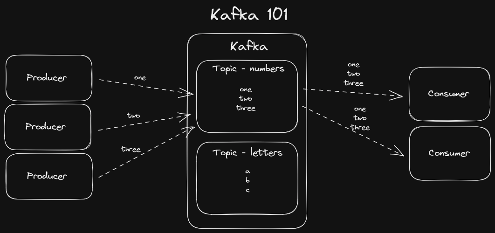

# Kafka 101 Demo

This repo is a demo of how Kafka works.

## Diagram

## Demo Requirements

- Docker
  - Windows Install: https://docs.docker.com/desktop/install/windows-install/
- `make` CLI
  - Windows Install: https://stackoverflow.com/questions/32127524/how-to-install-and-use-make-in-windows

## Setup

1. `make run` - Starts the Kafka cluster in a local Docker container
2. `make create-topic` - Creates the topic that is hard coded in the Makefile

## Usage

- `make producer` - Starts a producer that will send messages to the topic
- `make consumer` - Starts a consumer that will read messages from the topic

## Notes

- The best mental model for Kafka is a distributed commit log
- Kafka is designed for high throughput and low latency, and to scale horizontally
- Use cases:
  - Real time data processing
  - Log aggregation